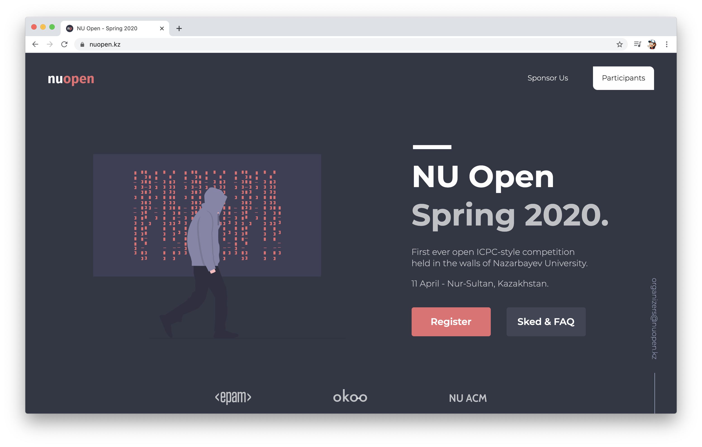

<div align="center">
  
</div>
<h1 align="center">
  NU Open 😍
</h1>
<p align="center">
   Built with <a href="https://www.gatsbyjs.org/" target="_blank">Gatsby</a> and hosted with <a href="https://www.netlify.com/" target="_blank">Netlify</a>
</p>
<p align="center">
  <a href="https://app.netlify.com/sites/dreamy-colden-c7c1ac/deploys" target="_blank">
    
  </a>
</p>



## 💻 Wanna run on your machine?

1. Clone the project

   ```sh
   git clone https://github.com/ironsoul0/nuopen.kz.git
   ```

1. Install the dependencies

   ```sh
   cd nuopen.kz
   npm install
   ```

3. Start the development server

   ```sh
   npm start
   ```

## 🚁 Contributing

Feel free to contribute and suggest any improvements.

This repository is a full source of the website created using Gatsby, React and styled-components.

## 🙏🏻 Acknowledgements

- Thanks to [bchiang7](https://github.com/bchiang7) and her awesome open-source project  [v4](https://github.com/bchiang7/v4). I have borrowed a few things to this project by looking at its source code.